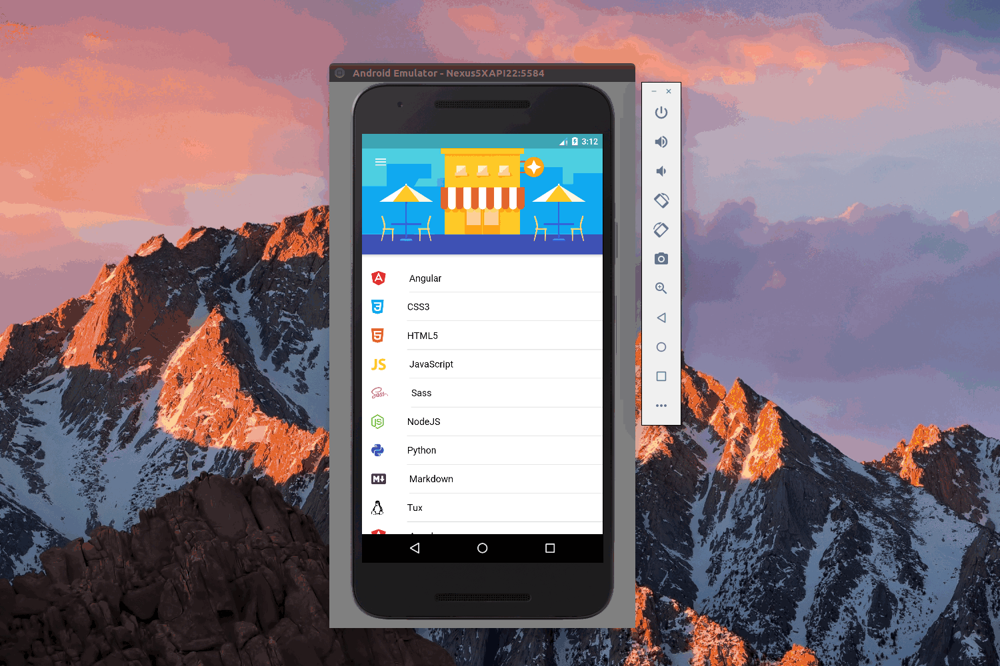

A transparent statusBar and toolBar DEMO in ionic.

|Android 4.x|Android 5.0+|iOS|
|:-:|:-:|:-:|
||||

<br>
<p align="center">
  
</p>
<br>

## Get started

* Clone this repository:  `git@github.com:jeneser/ionic-super-bar.git`
* Run `npm install` from the project root.
* Run `ionic serve` in a terminal from the project root.

## Transparent statusBar for android

* Run `ionic platform add android` in a terminal
* On `MainActivity.java` file on Android platform folder`platforms/android/src/../../MainActivity.java`, paste the following code after super.onCreate()

```java
if (Build.VERSION.SDK_INT >= Build.VERSION_CODES.KITKAT) {
	getWindow().getDecorView().setSystemUiVisibility(
	   View.SYSTEM_UI_FLAG_LAYOUT_FULLSCREEN |
	   View.SYSTEM_UI_FLAG_LAYOUT_STABLE);
}
```

* Remember to add these packages in MainActivity.java

```java
import android.os.Build;
import android.view.View;
```

* Last set `StatusBarBackgroundColor` in `config.xml`from the project root.
```
<preference name="StatusBarBackgroundColor" value="#33000000"/>
```

## File Structure

```
.
├── config.xml
├── ionic.config.json
├── package.json
├── README.md
├── resources
├── src
│   ├── app
│   │   ├── app.component.ts
│   │   ├── app.html
│   │   ├── app.module.ts
│   │   ├── app.scss				    * transparent statusBar and SuperBar
│   │   └── main.ts
│   ├── assets
│   │   ├── icon
│   │   └── img
│   ├── index.html
│   ├── manifest.json
│   ├── pages
│   │   ├── home				        * transparent statusBar and SuperBar page
│   │   │   ├── home.html
│   │   │   ├── home.scss
│   │   │   └── home.ts
│   │   ├── language-details			* transparent statusBar and SuperBar page
│   │   │   ├── language-details.html
│   │   │   ├── language-details.scss
│   │   │   └── language-details.ts
│   │   └── list
│   │       ├── list.html
│   │       ├── list.scss
│   │       └── list.ts
│   ├── service-worker.js
│   └── theme
│       └── variables.scss
├── tsconfig.json
└── tslint.json
```

## Environment

```
global packages:

    @ionic/cli-utils : 1.4.0
    Cordova CLI      : 7.0.1 
    Ionic CLI        : 3.4.0

local packages:

    @ionic/app-scripts              : 1.3.7
    @ionic/cli-plugin-cordova       : 1.4.0
    @ionic/cli-plugin-ionic-angular : 1.3.1
    Cordova Platforms               : android 6.2.3
    Ionic Framework                 : ionic-angular 3.4.2

System:

    Node       : v6.10.3
    OS         : Linux 4.8
    Xcode      : not installed
    ios-deploy : not installed
    ios-sim    : not installed
    npm        : 3.10.10 
```
